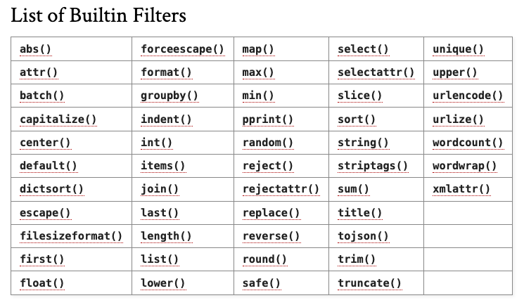

<style>

section {

  background: blue;
  color: white;
}
footer {
    position: absolute;
    left: 50px;
    right: 50px;
    height: 60px;
}

</style>
# Ansible Templating
  - Intro
  - Jinja2
  - Filters
  - Lookups (in the context of templating)
  - Documentation

  Goal: Refresher with some examples.

  **Simple** but very **powerful** technique found in almost **every** role you use or build.

---

##### My Ansible journey:
- Started to experiment in 2014 and loved it, "Simplicity as key design philosophy"
- 2018 Rabobank Automated the installation and configuration of BAE System NetReveal Product. YAML manifest, Jenkins, Ansible and Tower
- 2020 ABN-AMRO CISO CTI Platform built, configured and integrated theHive, MISP and Cortex into containers to run within EKS

We are all learning together here :-)

---
#### Ansible uses the Jinja2 template engine (_python  lib_)


hello world (_well if it's good enough for Kernighan_ ;-)

```py
from jinja2 import Template
template = Template("Hello {{ something }}!")
print(template.render(something="World"))
```

---
#### Ansible Jinja2 template - hello world example

- vars
- template file - <filename>.j2
- a single debug task using template lookup plugin

  This tiny playbook utilizes Jinja2 template file, a filter and use of a lookup plugin
---
#### playbook
```yaml
---
- name: Hello world
  hosts: all
  vars:
    something: world

  tasks:
    - name: Show templating results
      ansible.builtin.debug:
        msg: "{{ lookup('template', './some_template.j2') }}"

```
#### template file 
```
Hello {{ something | upper }}
```


---
## Jinja2 syntax

 for **Statements**

{{ ... }} for **Expressions** to **print** to the template output

{# ... #} for Comments not included in the template output

---
## Filters

```
{{ something | default('world') }}
{{ my_list | sort | join(',') }}
```

---
## Lookups

- Lookup plugins retrieve data from outside sources (files, databases, key/value stores, APIs).
- Execute and are evaluated on the Ansible control machine (Plugin vs Module).
- Data returned by a lookup plugin available using the standard templating system.
- Since Ansible 2.5, used more explicitly as part of Jinja2 expressions fed into the loop keyword.


---
## Simple lookup

```ansible

- name: show templating results
  debug:
    msg: "{{ lookup('template', './some_template.j2') }}"
```    

---
## Documenation

https://jinja.palletsprojects.com/en/3.1.x/templates/#id11